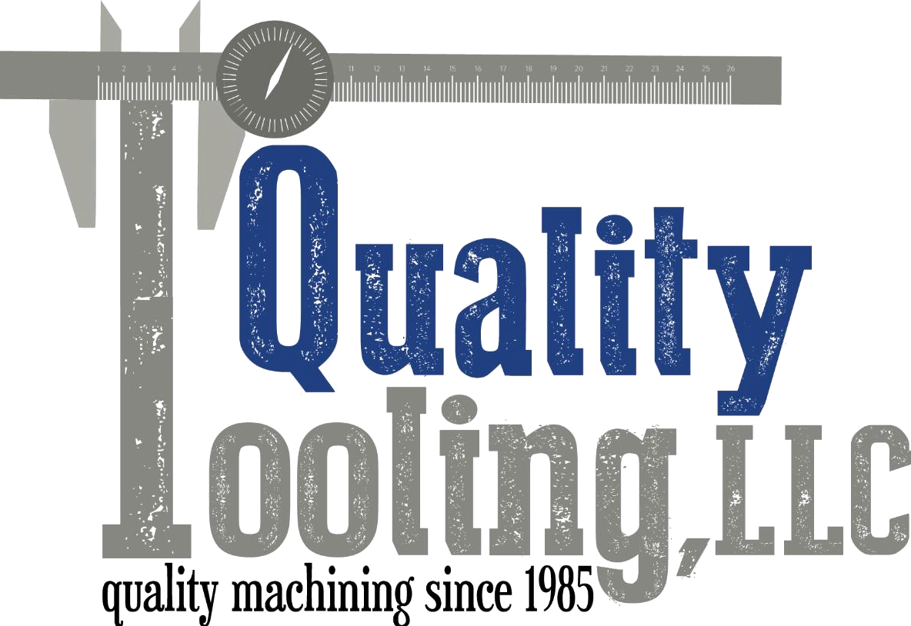

# Outreach Handoff — Quality Tooling, LLC

Prepared 2026-07-24 · Concept approved by Braden · Site live & auto-syncing weekly

## The one-liner

Family machine shop in Moultrie with a thriving Etsy metal-art business (7,300+ sales) whose
current Wix site shows only a fraction of what they sell. We built them a complete redesign that
mirrors their full Etsy catalog with live prices — and it updates itself from Etsy automatically
every week. It's already built; they just have to want it.

## Who to talk to

| Person | Role | Why they matter |
|---|---|---|
| **Jennifer** | Designer, customer service; runs the metal-art department AND the Etsy shop | **Start here.** The website is about the metal-art side of the business — it's her domain, and she writes all the shop copy. |
| John | Owner (founded the shop in 1985) | Final say. The "man with the dream" per the family's own bio. |
| Janice | Co-Owner | Founded it alongside John. |

Family texture for rapport (from their own Etsy bio): John & Janice started the shop in 1985
behind their single-wide trailer; all three kids (Jonathan, Timothy, Jennifer) work in the
business today, plus four employees. Faith and family feature prominently in how they tell
their story — they're proud of the humble-beginnings arc. Timothy runs the CNC/laser machines.

## Contact details

- **Phone:** (229) 324-2124
- **Email:** quality_tooling@windstream.net
- **Address:** 315 Wesley Chapel Rd, Moultrie, GA 31788
- **Original website:** https://www.qualitytoolingllc.com (Wix)
- **Our concept site:** https://quality-tooling.vercel.app ← the ONLY link you ever send
- **Etsy:** https://www.etsy.com/shop/QualityToolingLLC · **FB:** @QualityToolingLLC · **IG:** @quality_tooling_llc

> ⚠️ **Never send any factory-sites-bo-n.vercel.app URL.** That's the internal directory with
> other prospects' work on it. The prospect sees quality-tooling.vercel.app and nothing else.

## What we built — selling points, strongest first

1. **Their complete catalog, always current.** 151 products with photos and live prices, every
   card linking straight to its Etsy listing. Checkout stays on Etsy — nothing about how they
   sell changes, their site just finally shows everything they make.
2. **Automatic weekly Etsy sync.** Prices, photos, new products, and sold-out removals flow
   from Etsy to the website with no work from them, ever. The site cannot go stale. (Their
   current site is hand-maintained and shows a fraction of the shop.)
3. **Proof point from our first sync:** their Etsy shop had **15 products their website never
   showed** — pool towel hooks, patina letters, garden flags, seasonal stakes. We found them
   automatically and they're on the concept site now.
4. **Instant product search.** Type "nativity" or "monogram" anywhere on the site and every
   matching product appears with its price. Their current site can't do this.
5. **A design that's actually theirs.** Cream/navy/orange identity, serif display type, custom
   iconography — built around their story, not a Wix template. Feels like a brand, not a page.
6. **Fast everywhere.** Hand-built static pages, QA'd on phone/tablet/desktop. Loads near-
   instantly on a phone in a shop yard — no Wix bloat.
7. **Nothing lost.** Every page of their current site exists in the redesign: services, art
   shop, gallery, customer feedback, gift cards, every product category.
8. **Zero-risk launch.** They keep their domain and their Google ranking — we have a documented
   SEO-safe cutover (301s for every old URL, search-console handoff). Days, not weeks.

## Suggested demo flow (60 seconds)

1. Open **quality-tooling.vercel.app** — let the homepage land.
2. Click **Full Catalog** — scroll the 151-product wall with sections and prices.
3. Use the **search** — type "sun" → pool signs with prices appear instantly.
4. Click any product → it opens their real Etsy listing. "Your shop, your checkout — the site
   just finally keeps up with it."
5. Say: "This updates itself from your Etsy every Monday morning. You never touch it."

## Honest answers to likely questions

- **"We already have a website."** → This *is* your website, upgraded: same pages, same
  content, plus your whole catalog, search, and it maintains itself.
- **"How much work is this for us?"** → None. Etsy stays your single source of truth; the
  site follows it automatically. You keep listing on Etsy exactly like today.
- **"Will we lose our Google ranking?"** → No — you keep your domain; we 301-map every old
  URL and hand Google the new sitemap. The plan is written down before we touch anything.
- **"What about our digital files / t-shirts on Etsy?"** → Deliberately excluded so the site
  stays a clean showcase of the metal work; easy to include if they want them.

## Cautions

- The concept site is intentionally **hidden from Google** (noindex) while it's a private
  pitch — that's a feature, mention it if they ask why they can't google it.
- Prices on the concept refresh weekly (last sync 2026-07-24) — they'll always match Etsy
  within a few days, but don't quote a price as gospel in the meeting; click through to Etsy.
- Don't promise pages their current site doesn't have (we mirror their structure on purpose).
- Don't reference any other business's concept site.

## If they say yes — connecting their domain (they're on Wix)

The thing to say in the room: **"You keep your domain. Nothing gets transferred or bought.
It's a ten-minute settings change in your Wix account, we do it together on a screen-share,
and your old site stays up until the new one is verified live."**

How it actually works, in order:

1. **We prep the site for launch first** (our side, before touching DNS): remove the
   noindex/robots blocks, add sitemap + redirects per the launch checklist in CLAUDE.md.
2. **We add their domain to the Vercel project** (Settings → Domains → add
   `qualitytoolingllc.com` and `www`). Vercel then displays the exact two DNS records it wants.
3. **In their Wix account** (they log in; screen-share): **Domains → qualitytoolingllc.com →
   Advanced → Edit DNS**, then:
   - change the **A record** for `@` to the IP Vercel displayed (currently `76.76.21.21` —
     always use what Vercel shows, not this doc),
   - change the **CNAME** for `www` to `cname.vercel-dns.com`.
   That's the whole change. Wix will warn that the domain is being pointed away from the Wix
   site — that's expected; click through it.
4. **Wait for propagation** (minutes to a few hours, worst case 48h). Vercel issues the SSL
   certificate automatically once it sees the records. Old Wix site keeps serving until then —
   zero downtime.
5. **Verify + clean up**: we confirm the live domain, redirects, and Google Search Console.
   Then they can downgrade/cancel their **Wix site plan** (the monthly website fee). If the
   domain is *registered* at Wix, they keep that small annual registration fee with Wix —
   that's normal and fine.

Notes for likely follow-ups:

- **Email is unaffected.** Their business email is `quality_tooling@windstream.net` — not tied
  to the domain at all. (And even for domain email, we'd only touch A/CNAME records, never MX.)
- **If the domain turns out to be registered elsewhere** (GoDaddy etc.) and just connected to
  Wix: same two records, edited at that registrar instead. Nothing else changes.
- **Optional, later, never required for launch**: moving the domain registration away from Wix
  entirely (Wix → Domains → Advanced → Transfer away from Wix; they unlock it, get an auth
  code, and the new registrar pulls it in ~5–7 days; ICANN blocks transfers within 60 days of
  registration/renewal). Only worth it if they want to stop dealing with Wix altogether.
- Timeline end to end: **1–2 days**, most of it DNS propagation and verification. Expect a
  brief, normal ranking wobble while Google recrawls; equity carries over per the checklist.
